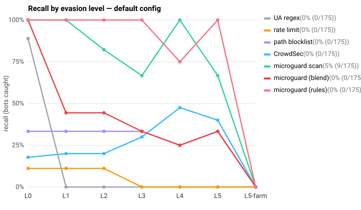
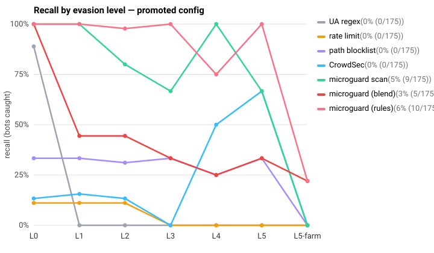
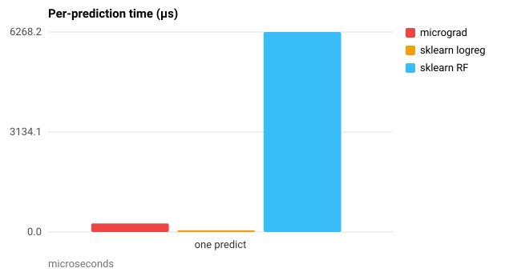

# Microguard, benchmarked on real-world data

_Generated by `python -m benchmarks.report`. Every number traces to a JSON under
`benchmarks/results/` and to code under `benchmarks/`. The rules that grade each
result were fixed before any run in [`PREREGISTRATION.md`](../../benchmarks/PREREGISTRATION.md)._

## What this set out to test

Two claims, kept separate:

1. **The tool** (heuristic rules + the shipped blend, and the offline
   `microguard scan` audit) catches bots that simple, widely used alternatives
   miss, without flagging humans.
2. **The micrograd model** catches bots the rules miss, without new human
   false positives.

Every bot is measured against baselines an operator could deploy instead — a
User-Agent blocklist, a rate limit, a path blocklist, and CrowdSec — and against
the same bots at rising levels of evasion (`L0` announces itself, `L5` is a real
headless browser pacing like a human from rotating IPs). Ground truth never
comes from the rules under test.

## Two honest limitations up front

- **Humans here are simulated** (lab scripts, real headless Chromium, and, for
  Zanbil, real people whose human label is a checkout-plus-assets proxy). The
  live-EC2 runbook in `docs/howto-evaluate-on-live-traffic.md` is the way to get
  real invited humans; that was out of scope for this pass.
- **The live check server ignores the forwarded `Referer`** (`server.py` builds
  every request with `referer=""`). So referer-based rules and features are
  inert on the live path, and the "no referrer on all requests" rule fires on
  any 20-plus-request session regardless of what the client actually sent. This
  inflates live recall on high-volume bots and is called out where it matters.
  The offline `microguard scan` does read the referer.

## Suite A — the evasion ladder

Exact ground truth, real production path, pooled over 5 seeds (1, 2, 3, 4, 5) per config. Recall is bots caught; a cell under 30 bots is marked inconclusive (rule 1).

### default: recall by level (human FP rate in the last column)

| detector | L0 | L1 | L2 | L3 | L4 | L5 | L5-farm | human FP |
|---|---|---|---|---|---|---|---|---|
| UA regex | 89% (40/45) | 0% (0/45) | 0% (0/45) | 0% (0/30) | 0% (0/40) | 0% (0/30) | 0% (0/50) | 0% (0/175) |
| rate limit | 11% (5/45) | 11% (5/45) | 11% (5/45) | 0% (0/30) | 0% (0/40) | 0% (0/30) | 0% (0/50) | 0% (0/175) |
| path blocklist | 33% (15/45) | 33% (15/45) | 33% (15/45) | 33% (10/30) | 25% (10/40) | 33% (10/30) | 0% (0/50) | 0% (0/175) |
| CrowdSec | 18% (8/45) | 20% (9/45) | 20% (9/45) | 30% (9/30) | 48% (19/40) | 40% (12/30) | 0% (0/50) | 0% (0/175) |
| microguard scan | 100% (45/45) | 100% (45/45) | 82% (37/45) | 67% (20/30) | 100% (40/40) | 67% (20/30) | 0% (0/50) | 5% (9/175) |
| microguard (rules) | 100% (45/45) | 100% (45/45) | 100% (45/45) | 100% (30/30) | 75% (30/40) | 100% (30/30) | 0% (0/50) | 0% (0/175) |
| microguard (blend) | 100% (45/45) | 44% (20/45) | 44% (20/45) | 33% (10/30) | 25% (10/40) | 33% (10/30) | 0% (0/50) | 0% (0/175) |

### promoted: recall by level (human FP rate in the last column)

| detector | L0 | L1 | L2 | L3 | L4 | L5 | L5-farm | human FP |
|---|---|---|---|---|---|---|---|---|
| UA regex | 89% (40/45) | 0% (0/45) | 0% (0/45) | 0% (0/30) | 0% (0/40) | 0% (0/30) | 0% (0/50) | 0% (0/175) |
| rate limit | 11% (5/45) | 11% (5/45) | 11% (5/45) | 0% (0/30) | 0% (0/40) | 0% (0/30) | 0% (0/50) | 0% (0/175) |
| path blocklist | 33% (15/45) | 33% (15/45) | 31% (14/45) | 33% (10/30) | 25% (10/40) | 33% (10/30) | 0% (0/50) | 0% (0/175) |
| CrowdSec | 13% (6/45) | 16% (7/45) | 13% (6/45) | 0% (0/30) | 50% (20/40) | 67% (20/30) | 0% (0/50) | 0% (0/175) |
| microguard scan | 100% (45/45) | 100% (45/45) | 80% (36/45) | 67% (20/30) | 100% (40/40) | 67% (20/30) | 0% (0/50) | 5% (9/175) |
| microguard (rules) | 100% (45/45) | 100% (45/45) | 98% (44/45) | 100% (30/30) | 75% (30/40) | 100% (30/30) | 22% (11/50) | 6% (10/175) |
| microguard (blend) | 100% (45/45) | 44% (20/45) | 44% (20/45) | 33% (10/30) | 25% (10/40) | 33% (10/30) | 22% (11/50) | 3% (5/175) |

### Does microguard (blend) beat each baseline?

A ✓ is the pre-registered test (rule 2): the shipped blend's recall interval clears the baseline's, with no extra human FPs, at that level.

| baseline | L0 | L1 | L2 | L3 | L4 | L5 | L5-farm |
|---|---|---|---|---|---|---|---|
| UA regex | · | ✓ | ✓ | ✓ | ✓ | ✓ | · |
| rate limit | ✓ | ✓ | ✓ | ✓ | ✓ | ✓ | · |
| path blocklist | ✓ | · | · | · | · | · | · |
| CrowdSec | ✓ | · | · | · | · | · | · |
| microguard scan | · | · | · | · | · | · | · |

### Does microguard (rules) beat each baseline?

A ✓ is the same test for the rule labeler alone — the stronger claim, at that level.

| baseline | L0 | L1 | L2 | L3 | L4 | L5 | L5-farm |
|---|---|---|---|---|---|---|---|
| UA regex | · | ✓ | ✓ | ✓ | ✓ | ✓ | · |
| rate limit | ✓ | ✓ | ✓ | ✓ | ✓ | ✓ | · |
| path blocklist | ✓ | ✓ | ✓ | ✓ | ✓ | ✓ | · |
| CrowdSec | ✓ | ✓ | ✓ | ✓ | · | ✓ | · |
| microguard scan | · | · | ✓ | ✓ | · | ✓ | · |

### What the ladder shows

- **The shipped blend throws away most of what the rules catch.** At L3 the rule labeler flags 100% of bots but the blend at its default 0.85 threshold flags only 33%. `compute_combined_score` floors a bot at the rule's own confidence, and the rules that survive a spoofed UA (rate, repeat-endpoint, no-referrer) sit at 0.70–0.85 — at or below the 0.85 block bar. Only the 0.90+ rules clear it. An operator running the blend as shipped gets materially worse recall than the rule labeler alone; the threshold, not the model, is the limiting factor.

- **The distributed browser farm is the rules' blind spot.** The L5-farm — one real browser profile across ten IPs, low volume each — is caught 0% by the rules in the default config, and 22% once the fingerprint signal is promoted (the shared-fingerprint-across-IPs rule is the one signal IP reputation structurally cannot provide). This is the case volume and path heuristics cannot see, and the reason the fingerprint signal exists. But promotion is **not free**: it lifts human false positives from 0/175 to 6% (10/175), because the fingerprint-absence rule flags clients that never run the script — here the scripted humans, and in production any text browser or privacy-tool user. By the pre-registered 0-FP bar (rule 3) the promoted signal is not yet safe to block on.

### The shipped model on the live path

The live per-request model score is not the inert 0.731 constant the docs describe (that is the offline/holdout value). It varies (median 0.64, both configs alike) and actually ranks bots above humans, actor-level AUC 0.77. The catch is calibration, not signal: the scores sit high, so at the `model_score > 0.5` cut the model flags every bot **and** every human (a useless operating point), and inside the blend the heuristic floor/cap drives the verdict. The ranking is real; no fixed threshold the tool uses exploits it. Suite D asks whether retraining on this distribution fixes it.

## Pre-registered predictions, graded

Written before any run (`benchmarks/PREREGISTRATION.md`). — means the cell was not measured.

| # | prediction | result |
|---|---|---|
| P1 | UA regex ≥95% at L0, ≤10% at L1–L5 | ❌ |
| P2 | blend ≥95% at L0 | ✅ |
| P3 | blend ≥70% at L1 and L2 | ❌ |
| P7 | blend flags 0 humans (default) | ✅ |
| P9 | shipped model near-constant on the live path | ❌ |
| P8 | promoted L5-farm recall ≤50% (refresher lag) | ✅ |

## Suite C — performance

On Apple M1 Pro, 17.2 GB, Python 3.13.13.

### /check latency (5,000 requests, rotating IPs)

| concurrency | p50 | p95 | p99 | req/s |
|---|---|---|---|---|
| 1 | 2.693 ms | 5.208 ms | 8.05 ms | 327.6 |
| 10 | 8.795 ms | 18.792 ms | 39.94 ms | 940.8 |
| 50 | 11.512 ms | 97.892 ms | 219.218 ms | 632.2 |

Deploy how-to target: p99 under 20 ms. It holds at concurrency 1 (p99 8.05 ms) but not under load (p99 219.218 ms at 50): the check server is a single-threaded stdlib `HTTPServer`, so requests serialize. An operator running several workers behind nginx would keep the per-worker concurrency low; the number to watch is p99 at your real peak concurrency.

micrograd: 269.43 µs/predict; sklearn logreg 53.06 µs; sklearn RF 6268.17 µs.

**Memory:** 285 bytes per tracked actor (10,000 actors added).

**Offline scan:** 28,143 lines/s on a 1,000,000-line Zanbil slice (28,925 sessions).

## Suite B1 — Zanbil, real e-commerce traffic

Real nginx logs from an Iranian shopping site (Kaggle mirror of doi:10.7910/DVN/3QBYB5, CC0; ~10.3M lines over five days). Labels come only from evidence the detectors do not read: verified crawlers are confirmed against Google/Bing published IP ranges, human-proxy actors are browser sessions that reached checkout and loaded assets. Counts pooled across the five days.

**Two findings, opposite directions.**

1. **Behaviour beats a UA blocklist on disguised crawlers.** With every crawler's User-Agent rewritten to Chrome, `microguard scan` still catches 31% (381/1245) of them by behaviour alone, where a UA blocklist catches 0% (1/1245) — it has nothing left to match.

2. **But `scan` over-flags real humans badly.** At its default threshold it flags 57% (1303/2273) of real human shoppers as bots, against 0% (1/2273) for a UA blocklist. Real shoppers on an image-heavy store make a median of 118 requests per session (p90 548, max 3,352), and the `> 100 requests` rule reads that as a scraper. This is the false-positive rate the scripted lab (Suite A) could not show, because those humans made a handful of requests with no embedded assets. The live blocker at its stricter 0.85 threshold spares most of them (the count rule sits at 0.85, and the block test is strict `>`), but `scan` as an audit tool is unsafe on this traffic as-is.

### B1a — verified crawlers, logs as-is (bots caught)

| detector | flagged |
|---|---|
| UA regex | 100% (862/862) |
| rate limit | 4% (32/862) |
| path blocklist | 0% (0/862) |
| microguard scan | 99% (851/862) |

### B1b — crawlers, UA rewritten to Chrome (bots caught by behaviour)

| detector | flagged |
|---|---|
| UA regex | 0% (1/1245) |
| rate limit | 3% (32/1245) |
| path blocklist | 0% (0/1245) |
| microguard scan | 31% (381/1245) |

### B1c — probe bots, probe requests removed (bots caught)

| detector | flagged |
|---|---|
| UA regex | 7% (9/127) |
| rate limit | 6% (8/127) |
| path blocklist | 8% (10/127) |
| microguard scan | 11% (14/127) |

### B1d — real human shoppers flagged (this is the FP rate)

| detector | flagged |
|---|---|
| UA regex | 0% (1/2273) |
| rate limit | 38% (854/2273) |
| path blocklist | 0% (0/2273) |
| microguard scan | 57% (1303/2273) |

## Suite D — does the micrograd model earn its place?

Trained on 1463 live per-request vectors from seeds [1, 2], levels ['L0', 'L1', 'L2']; tested on seeds [3, 4, 5] at every level (3470 vectors). Actor score = max over its requests.

| model | ROC-AUC | avg precision | recall@0.5 | added human FP | marginal catches | earns place? |
|---|---|---|---|---|---|---|
| micrograd_retrained | 1.000 | 1.000 | 100% (57/57) | 0 | 12 | ✅ |
| sklearn_logreg | 1.000 | 1.000 | 100% (57/57) | 0 | 12 | ✅ |
| sklearn_rf | 1.000 | 1.000 | 100% (57/57) | 0 | 12 | ✅ |
| micrograd_no_ua | 1.000 | 1.000 | 100% (57/57) | 0 | 12 | ✅ |
| shipped_baseline | 0.730 | 0.887 | 98% (56/57) | — | — | — |

**What the marginal catches are.** The retrained model's 12 catches the rules miss are exactly the bots the ladder showed as the rules' blind spot: 2 at L4, 10 at L5-farm — the distributed farm and the L4 stragglers — recovered with 0 added human false positives. The no-UA ablation lands the same score, so it is behaviour, not the user agent, doing the work.

**Read the 1.000 with the Zanbil result in hand.** A perfect AUC here is an *upper bound*, not a production number: the lab's humans are simulated and cleanly separable from bots in feature space, and sklearn logreg/RF hit the same 1.000, which says the *data* is separable, not that this model is special. On real human traffic that separation does not hold — `microguard scan` flags 57% of real Zanbil shoppers (B1 below). So Suite D shows the model *can* catch the farm behaviourally; it does not show a model that is safe to ship as a blocker. Replacing `data/model.json` stays out of scope.

**Leakage guard:** no single training feature separates the classes perfectly.

## Deviations from the pre-registration

1. **Anchor 3 (and prediction P9) named 0.731 and "near-constant" for the live
   model.** 0.731 is the offline/holdout constant; the live per-request path is
   different (train/serve skew, issue #19) — and, the part neither the anchor
   nor P9 anticipated, it is not near-constant at all: the score varies widely
   and ranks bots above humans (AUC ≈ 0.77, Suite A). The pre-registration
   assumed an inert constant; that was wrong, P9 is graded a miss on purpose,
   and Suite D takes up whether a retrained (recalibrated) model helps.
2. **CrowdSec sees a public-IP rewrite of the lab logs.** CrowdSec whitelists
   private ranges by default, and the lab actors live in 10.66/10.99. Each lab
   IP is mapped 1:1 to a public one for the CrowdSec replay only, and back
   afterwards; microguard scores the real lab IPs. Zanbil's real public IPs are
   untouched.
